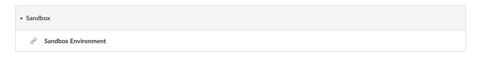
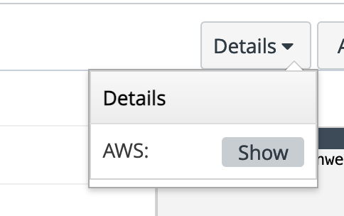
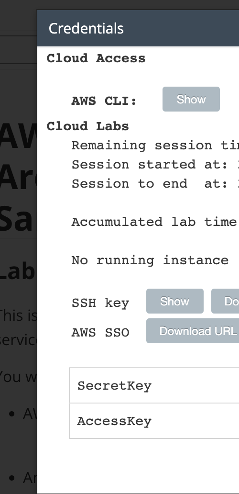

# Cloudformation_Templates


<h3>Prerequisites:</h3>

1) <b>AWS Cli:</b> <br>
    ```
    https://docs.aws.amazon.com/cli/latest/userguide/getting-started-install.html
    ```

<h4>Setting up AWS Cli:</h4>

1) Run the following command to check aws cli is installed.
   ```
   aws --version
   ```
2) Run the below command to add your credentials to interact with AWS.
    ```
    aws configure
    ```

3) 

<h3>Setting Up the AWS Lab Environment on AWS Academy Labs</h3>

<h4> Note: Please try to do these on Linux/Mac Terminal only </h4>

1. Login to AWS Academy and enter the following link https://awsacademy.instructure.com/courses/73733/modules.
2. Find the Sandbox environment at the end of the module.

3. Start the lab session to get the credentials to enter the environment.
4. Click the Details button and clock the show option near the AWS option.

5. Run the below command to add your temporary AWS Academy credentials to interact with AWS.
    ```
    aws configure
    ```
6. Add the AWS ACCESS KEY and AWS SECRET KEY when prompted by the console and use the default region as us-east-1:


<h3> Running the commands </h3>

1. Run the below command to deploy the cloudformation template:
```
make deploy
```

2. To SSH into the Ec2 instance:
```
make sshec2
```

3. To connect to the Postgres Database:
```
make sshrds
```

4. To destroy the stack and remove all the infrastructure:
```
make cleanup
```